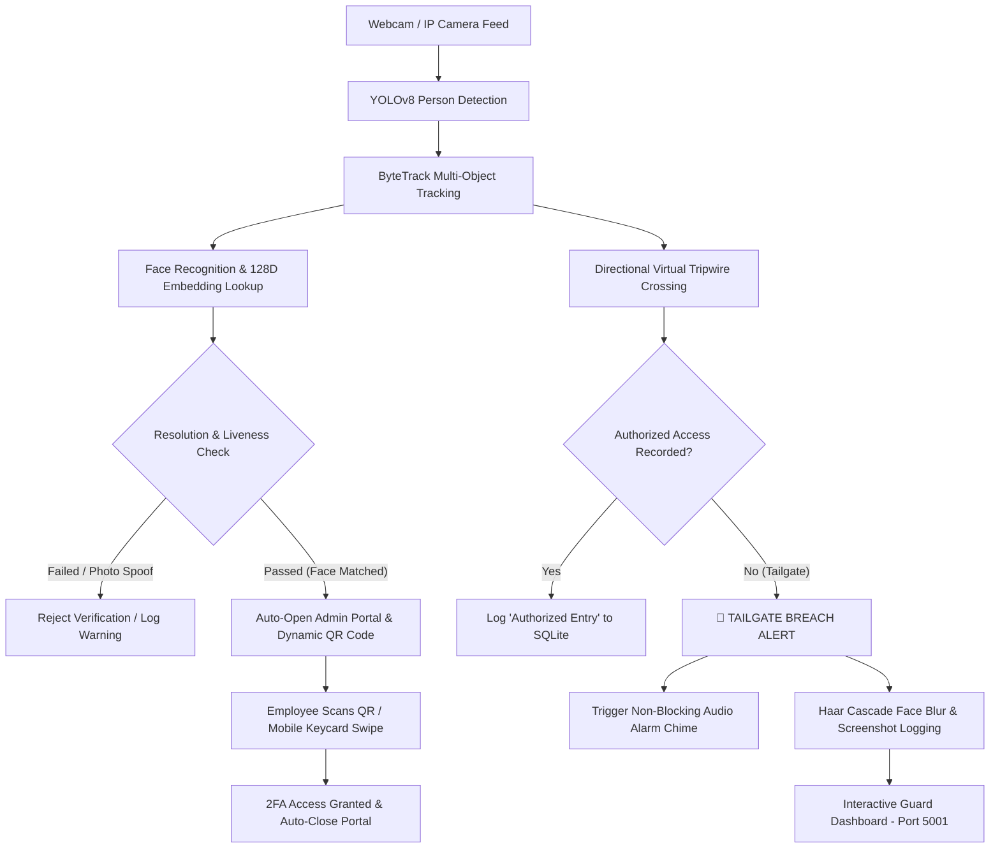

# 🛡️ Edge AI Tailgating Detection & 2FA Access System

An enterprise-grade, edge-computed Computer Vision system designed to detect and log physical tailgating infractions (unauthorized entry events) in real-time. 

By combining **YOLOv8 Object Detection**, **ByteTrack Multi-Object Tracking**, a **Directional Virtual Tripwire**, a **2FA Biometric & QR Verification Engine**, **Passive Liveness Detection (EAR)**, and an **Interactive Evidence Dashboard**, this system provides a complete software-defined alternative to expensive physical security turnstiles.

---

## 🏗️ System Architecture & Workflow



---

## 🌟 Key Features

### 1. 🔑 2-Factor Authentication (2FA) Pipeline (`src/auth_pipeline.py`)
- **Biometric Face Enrollment**: Pre-computes 128D face encodings from images in `known_faces/` (supports `.jpg`, `.jpeg`, `.png`, `.webp`, `.bmp`, `.tiff`).
- **Resolution Guard**: Enforces a minimum `60x60` px face crop dimension before encoding to eliminate false positives when subjects are too far away.
- **Passive Liveness Detection (EAR)**: Computes Eye Aspect Ratio (EAR) and monitors EAR variance across 5 consecutive frames. Rejects static photos or phone screen spoofing attempts with a `⚠️ SPOOF ATTEMPT DETECTED` alert.
- **5-Second Session Expiration**: Active face matches automatically time out after 5 seconds if no QR code scan or mobile keycard swipe occurs.

### 2. 📱 Admin Portal & Dynamic QR Badge Generator (`src/access_system.py`)
- **Auto-Browser Launch**: When a face match occurs, the system automatically launches the Admin Portal (`http://localhost:5005/admin`) in a single browser window.
- **Expiring JWT Tokens**: Dynamic QR codes embed 60-second expiring JWT badge tokens (`exp` claim) to prevent replay attacks.
- **Mobile Keycard Swipe**: Employees can scan the QR code using any smartphone on local Wi-Fi to load `/keycard` and authorize their entry.
- **Auto-Disappearing Page**: Upon entry verification, the Admin Portal displays `✅ ACCESS GRANTED` and automatically closes the browser tab.

### 3. 🔒 Cyber Security & Rate Limiting (`Flask-Limiter`)
- **DDoS & Brute-Force Shield**: Enforces rate limiting on Flask routes:
  - `POST /swipe`: Restricted to **5 requests per second** per IP.
  - `GET /admin`: Restricted to **10 requests per minute** per IP.
- **API Key Security**: Validates requests via `x-api-key` headers or JWT bearer tokens.

### 4. 🔊 Non-Blocking Audio Breach Alarm (`src/live_capture.py`)
- Spawns a dedicated background daemon thread (`BreachAlarmThread`) running `winsound.Beep(2000, 500)` (Windows) or `\a` terminal bell (Linux/macOS) whenever a tailgate breach occurs, ensuring zero OpenCV video frame stuttering.

### 5. 👥 Privacy Compliance (GDPR Face Blurring & Data Retention)
- **Biometric Face Blurring**: Automatically applies a `51x51` Gaussian blur ROI over faces in breach screenshots.
- **Data Retention Purge**: Includes `src/data_retention.py` to scrub database records and screenshot evidence older than 30 days.

---

## 💼 Business ROI vs. Physical Turnstiles

| Expense Category | Physical Hardware Turnstile | SecureAccess Software System |
| :--- | :--- | :--- |
| **Capital Expenditure (CapEx)** | **$15,000 – $25,000** per lane | **$0** (Runs on existing workstations) |
| **Installation & Masonry** | **$5,000 – $10,000** (Floor bolting, power lines) | **$100** (Mounting standard 1080p webcam) |
| **Spatial Footprint** | Obstructs floor space / fire exits | **Zero footprint** (Mounted overhead) |
| **Maintenance** | **$1,500 – $3,000** annual mechanical upkeep | **$0** (No moving parts) |
| **Biometric Auditing** | Requires extra hardware | **Built-in** (2FA + Face Blur Evidence Logs) |
| **TOTAL INITIAL COST** | **$20,000 – $35,000** per lane | **~$100 – $300** (Standard webcam) |

---

## 🛠️ Installation & Setup

### 1. Clone Repository & Create Virtual Environment
```bash
git clone https://github.com/Khant919/Tailgating-Detection.git
cd Tailgating-Detection

# Create virtual environment
python -m venv venv

# Activate on Windows (PowerShell):
.\venv\Scripts\Activate.ps1

# Activate on Linux/macOS:
source venv/bin/activate
```

### 2. Install Dependencies
```bash
pip install -r requirements.txt
```
*(Note: Windows Python 3.13 users can use `pip install dlib-bin` for precompiled binaries).*

### 3. Add Employee Photos for Face Enrollment
Place employee reference photos inside the `known_faces/` folder:
```
known_faces/
├── Alice.png
├── Khant.png
└── Bob.webp
```

---

## 🚀 Running the Project

### 1. Launch the Main Application
```bash
python main.py
```
This initializes YOLOv8 detection, enrolls employee faces from `known_faces/`, starts the Flask Access Server on `http://127.0.0.1:5005`, and opens the OpenCV live webcam stream.

### 2. Testing 2FA Authentication Flow
1. **Approach Camera**: Step in front of the camera.
2. **Face Match**: Bounding box turns **Yellow** (`FACE MATCHED: AWAITING QR...`).
3. **Admin Portal Auto-Opens**: `http://localhost:5005/admin` opens in your browser with a dynamic QR code.
4. **Scan QR or Keycard**: Scan the QR code or tap `/keycard` swipe.
5. **Access Granted**: Bounding box turns **Green** (`ACCESS GRANTED`), the Admin Portal page displays success and auto-closes.

### 3. Running Unit Test Suite
```bash
python -m unittest discover -s tests -p "test_*.py"
```

---

## 🤝 Contributing

Contributions are welcome! Follow these steps to contribute:
1. **Fork the Repository**
2. **Create a Feature Branch**: `git checkout -b feature/amazing-feature`
3. **Commit your changes**: `git commit -m "Add amazing feature"`
4. **Push to branch**: `git push origin feature/amazing-feature`
5. **Open a Pull Request**

---

## 📜 License
Distributed under the **MIT License**. See `LICENSE` for details.
