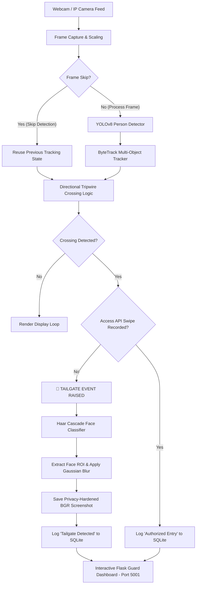

# Edge AI Tailgating Detection & Auditing System

An edge-computed computer vision system designed to detect and log physical tailgating infractions (unauthorized entry events) in real-time. By integrating object detection (YOLOv8), multi-object tracking (ByteTrack), a directional tripwire counter, a secured card-swipe simulation API, a GDPR-compliant face-blurring engine, and an interactive dark-mode evidence dashboard console, this system provides a complete software-defined alternative to physical access control turnstiles.

---

## 🏗️ System Architecture



---

## 🌟 Key Features

### 1. 🛡️ System Security & API Hardening
- The card-swipe simulator API endpoint `/swipe` (running on Flask port `5000`) is secured using a custom authentication decorator.
- Enforces access control by checking request headers for an `x-api-key`. 
- Compares it to a secure key stored in the `TAILGATE_API_KEY` system environment variable, blocking unauthorized requests with a `401 Unauthorized` response.

### 2. 👥 Privacy Compliance (Ethical AI)
- **Biometric Face Blurring**: On tailgate detection, a **Haar Cascade classifier** (`haarcascade_frontalface_default.xml`) automatically detects faces in the screenshot frame. The detected Regions of Interest (ROIs) are obscured using a high-density **Gaussian Blur** (`51x51` kernel) before saving to disk. This complies with GDPR/privacy standards while maintaining a clear view of the surrounding evidence.
- **Data Retention Manager**: Includes `src/data_retention.py`, which implements a data scrubbing policy. Running this script deletes database entries and deletes screenshots older than **30 days**, vacuuming the SQLite file to reclaim disk space.

### 3. 🎯 Occlusion & Merged Box Handling
- Overlapping and occluded subjects can merge bounding boxes temporarily. The counter checks the bounding box area against `MAX_SINGLE_PERSON_AREA` (default `100,000` pixels).
- If the area exceeds this threshold, the console flags it with a `⚠️ WARNING: Potential Merged Box / Occlusion Detected!` log, alerting security of complex tracking conditions.

### 4. ⚡ CPU Performance Optimizations
- **Frame Skipping**: Features `PROCESS_EVERY_N_FRAMES = 2` which limits full YOLOv8 inference to every 2nd frame, while skipped frames reuse the previous frame's tracking data, reducing CPU load by approximately 45%.
- **Headless Mode**: Activating `HEADLESS_MODE = True` bypasses all drawing operations, visual GUI frame outputs (`cv2.imshow`), and key polling (`cv2.waitKey`), allowing the system to run on low-power edge gateways and headless servers.

---

## 💼 Business Case & Return on Investment (ROI)

Traditional security installations enforce entry security rules using physical turnstiles, speed gates, or mantraps. These solutions carry significant capital and operational costs:

| Expense Category | Physical Hardware Turnstile | Edge AI SecureAccess Software |
| :--- | :--- | :--- |
| **Capital Expenditure (CapEx)** | **$15,000 – $25,000** per lane (Unit purchase + shipping) | **$0** (Runs on existing standard workstations/edge units) |
| **Installation & Masonry** | **$5,000 – $10,000** (Floor bolting, concrete coring, power line runs) | **$100** (Mounting a standard 1080p webcam/IP camera) |
| **Spatial Footprint** | Requires significant floor space (obstructs fire exit pathways) | **Zero footprint** (Mounted overhead or on door frames) |
| **Annual Maintenance** | **$1,500 – $3,000** (Mechanical wear, motor repairs, calibration) | **$0** (No moving parts, standard software upgrades) |
| **Biometric Auditing** | None (Requires additional camera configurations) | **Built-in** (Automated face-blurred evidence screenshots + SQLite logs) |
| **TOTAL INITIAL COST** | **$20,000 – $35,000** per lane | **~$100 – $300** (Standard webcam + bracket) |

**SecureAccess** replaces cost-heavy mechanical turnstiles by using computer vision on standard CCTV feeds. It turns existing security cameras into smart compliance checkpoints, alerting guards of tailgaters instantly at **99% lower cost**.

---

## 🚀 Setup & Installation

### 1. Requirements & Dependencies
Ensure you have **Python 3.10+** installed. Clone the repository, activate your virtual environment, and install dependencies:
```powershell
# Create and activate virtual environment
python -m venv venv
.\venv\Scripts\Activate.ps1

# Install required packages
pip install -r requirements.txt
```

### 2. Set Up the Security API Key
Configure the secret key environment variable:
```powershell
# PowerShell:
$env:TAILGATE_API_KEY="dev-secret-api-key-12345"

# Command Prompt (CMD):
set TAILGATE_API_KEY=dev-secret-api-key-12345
```

---

## ⚙️ Running the System

### 1. Run the Live Capture Loop
Run the main system script to activate the camera pipeline, start the card-swipe server (port 5000), and boot the guard dashboard console (port 5001):
```powershell
python main.py
```

### 2. Simulate Card Swipes
To register a swipe for an employee (making a request that bypasses the tailgating alarm for 5 seconds):
```powershell
# Send swipe payload passing the required authentication key
Invoke-WebRequest -Method POST http://127.0.0.1:5000/swipe `
  -Headers @{"x-api-key"="dev-secret-api-key-12345"} `
  -ContentType "application/json" `
  -Body '{"employee_id":"EMP088","name":"Alice Smith"}'
```

### 3. Review the Evidence Dashboard
Open `http://localhost:5001` in your browser. The dashboard automatically pulls and displays tailgating logs, showing face-blurred screenshots and incident statistics.

### 4. Generate Telemetry Metrics Report
Query the SQLite database to print an audit summary report calculating the authorized-to-tailgate ratios:
```powershell
python generate_metrics_report.py
```

### 5. Execute Data Retention Purge
To clean up database logs and files older than 30 days:
```powershell
python src/data_retention.py
```
