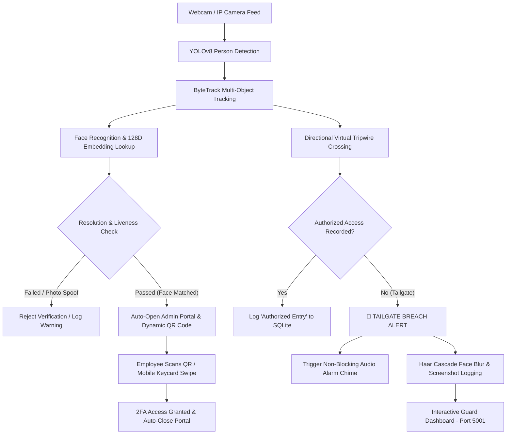

# 🛡️ Edge AI Tailgating Detection & 2FA Access System

An enterprise-grade, edge-computed Computer Vision system designed to detect and log physical tailgating infractions (unauthorized entry events) in real-time. 

By combining **YOLOv8 Object Detection**, **ByteTrack Multi-Object Tracking**, a **Directional Virtual Tripwire**, a **2FA Biometric & QR Verification Engine**, **Passive Liveness Detection (EAR)**, and an **Interactive Evidence Dashboard**, this system provides a complete software-defined alternative to expensive physical security turnstiles.

---

## 🏗️ System Architecture & Workflow



---

## 🌟 Key Features

### 1. 🔑 2-Factor Authentication (2FA) Pipeline (`src/auth_pipeline.py`)
- **Biometric Face Enrollment**: Pre-computes 128D face encodings from images in `known_faces/` (supports `.jpg`, `.jpeg`, `.png`, `.webp`, `.bmp`, `.tiff`).
- **Resolution Guard**: Enforces a minimum `60x60` px face crop dimension before encoding to eliminate false positives when subjects are too far away.
- **Passive Liveness Detection (EAR)**: Computes Eye Aspect Ratio (EAR) and monitors EAR variance across 5 consecutive frames. Rejects static photos or phone screen spoofing attempts with a `⚠️ SPOOF ATTEMPT DETECTED` alert.
- **5-Second Session Expiration**: Active face matches automatically time out after 5 seconds if no QR code scan or mobile keycard swipe occurs.

### 2. 📱 Admin Portal & Dynamic QR Badge Generator (`src/access_system.py`)
- **Auto-Browser Launch**: When a face match occurs, the system automatically launches the Admin Portal (`http://localhost:5005/admin`) in a single browser window.
- **Expiring JWT Tokens**: Dynamic QR codes embed 60-second expiring JWT badge tokens (`exp` claim) to prevent replay attacks.
- **Mobile Keycard Swipe**: Employees can scan the QR code using any smartphone on local Wi-Fi to load `/keycard` and authorize their entry.
- **Auto-Disappearing Page**: Upon entry verification, the Admin Portal displays `✅ ACCESS GRANTED` and automatically closes the browser tab.

### 3. 🔒 Cyber Security & Rate Limiting (`Flask-Limiter`)
- **DDoS & Brute-Force Shield**: Enforces rate limiting on Flask routes:
  - `POST /swipe`: Restricted to **5 requests per second** per IP.
  - `GET /admin`: Restricted to **10 requests per minute** per IP.
- **API Key Security**: Validates requests via `x-api-key` headers or JWT bearer tokens, compared in constant time.
- **Secrets from the environment**: the JWT signing key, API key and dashboard password are read from environment variables (see `.env.example`). The committed development fallbacks are public and the app prints a loud warning while they are in use.
- **Loopback by default**: both servers bind `127.0.0.1`. Set `TAILGATE_BIND_HOST=0.0.0.0` only on a trusted network — this is required for the phone QR flow.

### 3b. 🪪 Identity-Bound Entry Authorisation
A swipe only authorises the person it belongs to. Each tripwire crossing reports the
`track_id` that crossed, and that track's own 2FA session is matched against the queued
swipes — so if Alice swipes and Bob walks through, Bob is flagged as a **tailgate** and
Alice's swipe is left in the queue for her. Without this binding any swipe would
authorise any body, which is precisely the attack this system exists to catch.

When no face match exists for the crossing person, the system falls back to card-only
mode and logs the entry as unverified.

### 4. 🔊 Non-Blocking Audio Breach Alarm (`src/live_capture.py`)
- Spawns a dedicated background daemon thread (`BreachAlarmThread`) running `winsound.Beep(2000, 500)` (Windows) or `\a` terminal bell (Linux/macOS) whenever a tailgate breach occurs, ensuring zero OpenCV video frame stuttering.

### 5. 👥 Privacy Compliance (GDPR Face Blurring & Data Retention)
- **Biometric Face Blurring**: Automatically applies a `51x51` Gaussian blur ROI over faces in breach screenshots. The live guard view keeps faces unblurred; only the frame written to disk is anonymised. If the cascade cannot load, the whole frame is blurred rather than persisting identifiable faces.
- **Authenticated Evidence Dashboard**: breach screenshots are served only behind HTTP Basic Auth (`TAILGATE_DASHBOARD_USER` / `TAILGATE_DASHBOARD_PASSWORD`).
- **Data Retention Purge**: `src/data_retention.py` scrubs database records and screenshot evidence older than 30 days, and now runs automatically at every startup as well as standalone.
- **No biometric data in version control**: `known_faces/` and `screenshots/` are gitignored. Never commit photographs of real people.

### 5b. 👥 Occlusion-Aware Counting
Two people walking shoulder-to-shoulder are often detected as a **single** bounding box —
the classic way a tailgater slips through a people counter. Each box is therefore resolved
into a headcount before its crossing is counted:

- **Width-to-height ratio** is the primary signal, because it is scale invariant: someone
  standing twice as close grows in both dimensions, so the ratio is unchanged, while raw
  pixel area is not comparable between near and far people.
- **Optical flow** inside the box confirms a merge when the point velocities separate into
  two diverging clusters (split at the largest gap, not at zero, so noise around a
  stationary mean is not mistaken for two people).
- **Box area** relative to the frame acts as a third check.

A merge must be visible in several frames before it inflates the count, so one noisy
detection cannot manufacture a phantom person. When a merged box crosses, the tracked
person gets a normal entry event and **each hidden person gets their own entry event
flagged as occluded**. An occluded entry has no track and no authentication, and is barred
from consuming anyone else's swipe — so it always resolves to a tailgate, logged as
`Tailgate Detected (Occluded)`.

### 6. 📐 Resolution-Independent Tripwire
The counting line and the occlusion threshold are derived from frame-relative ratios and
calibrated on the first frame, so the same config works on 480p, 720p and 1080p cameras.
Passing explicit pixel coordinates to `TripwireCounter` pins the line and disables rescaling.

---

## 💼 Business ROI vs. Physical Turnstiles

| Expense Category | Physical Hardware Turnstile | SecureAccess Software System |
| :--- | :--- | :--- |
| **Capital Expenditure (CapEx)** | **$15,000 – $25,000** per lane | **$0** (Runs on existing workstations) |
| **Installation & Masonry** | **$5,000 – $10,000** (Floor bolting, power lines) | **$100** (Mounting standard 1080p webcam) |
| **Spatial Footprint** | Obstructs floor space / fire exits | **Zero footprint** (Mounted overhead) |
| **Maintenance** | **$1,500 – $3,000** annual mechanical upkeep | **$0** (No moving parts) |
| **Biometric Auditing** | Requires extra hardware | **Built-in** (2FA + Face Blur Evidence Logs) |
| **TOTAL INITIAL COST** | **$20,000 – $35,000** per lane | **~$100 – $300** (Standard webcam) |

---

## 🛠️ Installation & Setup

### 1. Clone Repository & Create Virtual Environment
```bash
git clone https://github.com/Khant919/Tailgating-Detection.git
cd Tailgating-Detection

# Create virtual environment
python -m venv venv

# Activate on Windows (PowerShell):
.\venv\Scripts\Activate.ps1

# Activate on Linux/macOS:
source venv/bin/activate
```

### 2. Install Dependencies
```bash
pip install -r requirements.txt
```

**Python version:** use **CPython 3.10 – 3.13**. The `face_recognition` stage needs `dlib`, and
precompiled `dlib-bin` wheels are only published up to 3.13 — on 3.14 there is no wheel and the
source build requires CMake + Visual Studio Build Tools.

On Windows, install the precompiled dlib wheel *before* the rest, then install
`face_recognition` without its dependencies (its metadata pins the `dlib` sdist,
which would otherwise shadow `dlib-bin` and trigger a source build):

```bash
pip install dlib-bin
pip install --no-deps face_recognition face_recognition_models
pip install -r requirements.txt
```

If `face_recognition` or `pyzbar` are unavailable, the app still runs: YOLO detection,
tracking, tripwire counting, tailgate alerting, evidence capture and the dashboard all work,
and only the face-matching / camera-QR stages of 2FA are skipped.

`pyzbar` additionally needs the [Visual C++ 2013 Redistributable](https://www.microsoft.com/en-US/download/details.aspx?id=40784)
on Windows, otherwise `libzbar-64.dll` fails to load.

### 3. Add Employee Photos for Face Enrollment
Place employee reference photos inside the `known_faces/` folder:
```
known_faces/
├── Alice.png
├── Khant.png
└── Bob.webp
```

---

## 🚀 Running the Project

### 0. Configure secrets (do this first)
Copy `.env.example` and set real values, or export them in your shell. The app runs
without this, but prints a security warning because the fallback secrets are published
in this repository:

```bash
python -c "import secrets; print(secrets.token_urlsafe(48))"
```

```powershell
$env:TAILGATE_JWT_SECRET = "<generated value>"
$env:TAILGATE_API_KEY = "<generated value>"
$env:TAILGATE_DASHBOARD_PASSWORD = "<your password>"
```

### 1. Launch the Main Application
```bash
python main.py
```
This warns about insecure secrets, runs the data-retention sweep, initializes YOLOv8
detection, enrolls employee faces from `known_faces/`, starts the Flask Access Server on
`http://127.0.0.1:5005`, starts the evidence dashboard on `http://127.0.0.1:5001`, and
opens the OpenCV live webcam stream.

Both servers live inside `main.py`. **Closing the video window (`q`) stops the dashboard
too** — it is a daemon thread, not a separate service.

### 1b. Open the Evidence Dashboard
Visit `http://localhost:5001` **while `main.py` is running** and sign in with
`TAILGATE_DASHBOARD_USER` / `TAILGATE_DASHBOARD_PASSWORD`.

### 1c. Simulate a card swipe
```bash
curl -X POST http://127.0.0.1:5005/swipe -H "x-api-key: $TAILGATE_API_KEY" -H "Content-Type: application/json" -d "{\"employee_id\":\"EMP001\",\"name\":\"Alice Smith\"}"
```

### 2. Testing 2FA Authentication Flow
1. **Approach Camera**: Step in front of the camera.
2. **Face Match**: Bounding box turns **Yellow** (`FACE MATCHED: AWAITING QR...`).
3. **Admin Portal Auto-Opens**: `http://localhost:5005/admin` opens in your browser with a dynamic QR code.
4. **Scan QR or Keycard**: Scan the QR code or tap `/keycard` swipe.
5. **Access Granted**: Bounding box turns **Green** (`ACCESS GRANTED`), the Admin Portal page displays success and auto-closes.

### 3. Running Unit Test Suite
```bash
python -m unittest discover -s tests -p "test_*.py"
```

---

## 🤝 Contributing

Contributions are welcome! Follow these steps to contribute:
1. **Fork the Repository**
2. **Create a Feature Branch**: `git checkout -b feature/amazing-feature`
3. **Commit your changes**: `git commit -m "Add amazing feature"`
4. **Push to branch**: `git push origin feature/amazing-feature`
5. **Open a Pull Request**

---

## 📜 License
Distributed under the **MIT License**. See [LICENSE](LICENSE) for details.
